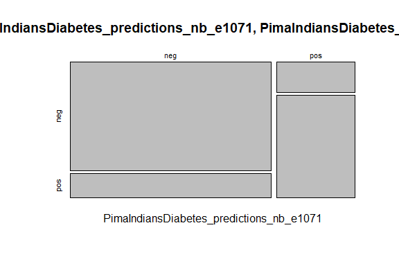

Business Intelligence Project
================
<WISDOM>
\<23/10/23\>

- [Consider a library as the location where packages are
  stored.](#consider-a-library-as-the-location-where-packages-are-stored)
- [Execute the following command to list all the libraries available in
  your](#execute-the-following-command-to-list-all-the-libraries-available-in-your)
- [computer:](#computer)
  - [R Markdown](#r-markdown)
- [STEP 1. Install and Load the Required Packages
  —-](#step-1-install-and-load-the-required-packages--)
  - [1. Split the dataset ====](#1-split-the-dataset-)
- [Define a 75:25 train:test data split of the
  dataset.](#define-a-7525-traintest-data-split-of-the-dataset)
- [That is, 75% of the original data will be used to train the model
  and](#that-is-75-of-the-original-data-will-be-used-to-train-the-model-and)
- [25% of the original data will be used to test the
  model.](#25-of-the-original-data-will-be-used-to-test-the-model)
- [Split the dataset into a training and test
  set](#split-the-dataset-into-a-training-and-test-set)
  - [2. Train a Naive Bayes classifier using the training dataset
    —-](#2-train-a-naive-bayes-classifier-using-the-training-dataset--)
    - [2.a. OPTION 1: “NaiveBayes()” function in the “klaR” package
      —-](#2a-option-1-naivebayes-function-in-the-klar-package--)

# Consider a library as the location where packages are stored.

# Execute the following command to list all the libraries available in your

# computer:

``` r
.libPaths()
```

    ## [1] "C:/Users/25479/AppData/Local/R/win-library/4.3"
    ## [2] "C:/Program Files/R/R-4.3.1/library"

``` r
lapply(.libPaths(), list.files)
```

    ## [[1]]
    ##   [1] "abind"           "Amelia"          "askpass"         "backports"      
    ##   [5] "base64enc"       "BayesFactor"     "bit"             "bit64"          
    ##   [9] "brew"            "brio"            "broom"           "bslib"          
    ##  [13] "cachem"          "Cairo"           "callr"           "car"            
    ##  [17] "carData"         "caret"           "circlize"        "classInt"       
    ##  [21] "cli"             "clipr"           "clock"           "coda"           
    ##  [25] "collections"     "colorspace"      "colourpicker"    "combinat"       
    ##  [29] "commonmark"      "contfrac"        "corrplot"        "covr"           
    ##  [33] "cowplot"         "cpp11"           "crayon"          "crosstalk"      
    ##  [37] "curl"            "cyclocomp"       "data.table"      "dendextend"     
    ##  [41] "desc"            "deSolve"         "diagram"         "diffobj"        
    ##  [45] "digest"          "dplyr"           "DT"              "e1071"          
    ##  [49] "ellipse"         "ellipsis"        "elliptic"        "emmeans"        
    ##  [53] "estimability"    "evaluate"        "factoextra"      "FactoMineR"     
    ##  [57] "fansi"           "farver"          "fastICA"         "fastmap"        
    ##  [61] "flashClust"      "fontawesome"     "forcats"         "foreach"        
    ##  [65] "formatR"         "formattable"     "fs"              "future"         
    ##  [69] "future.apply"    "generics"        "ggforce"         "ggplot2"        
    ##  [73] "ggpubr"          "ggraph"          "ggrepel"         "ggsci"          
    ##  [77] "ggsignif"        "glmnet"          "GlobalOptions"   "globals"        
    ##  [81] "glue"            "gower"           "graphlayouts"    "gridExtra"      
    ##  [85] "gtable"          "hardhat"         "haven"           "highr"          
    ##  [89] "hms"             "htmltools"       "htmlwidgets"     "httpuv"         
    ##  [93] "httr"            "hypergeo"        "igraph"          "ipred"          
    ##  [97] "isoband"         "iterators"       "janeaustenr"     "jomo"           
    ## [101] "jpeg"            "jquerylib"       "jsonlite"        "kableExtra"     
    ## [105] "klaR"            "knitr"           "labeling"        "labelled"       
    ## [109] "languageserver"  "later"           "lava"            "lazyeval"       
    ## [113] "leaps"           "LiblineaR"       "lifecycle"       "lintr"          
    ## [117] "listenv"         "lme4"            "lubridate"       "magick"         
    ## [121] "magrittr"        "markdown"        "Matrix"          "MatrixModels"   
    ## [125] "memery"          "memoise"         "mice"            "mime"           
    ## [129] "miniUI"          "minqa"           "mitml"           "mlbench"        
    ## [133] "mockery"         "ModelMetrics"    "multcompView"    "munsell"        
    ## [137] "mvtnorm"         "naivebayes"      "naniar"          "NHANES"         
    ## [141] "nloptr"          "norm"            "numDeriv"        "openssl"        
    ## [145] "ordinal"         "pacman"          "pan"             "parallelly"     
    ## [149] "pbapply"         "pbkrtest"        "pillar"          "pkgbuild"       
    ## [153] "pkgconfig"       "pkgload"         "plyr"            "png"            
    ## [157] "polyclip"        "polynom"         "praise"          "prettyunits"    
    ## [161] "pROC"            "processx"        "prodlim"         "progress"       
    ## [165] "progressr"       "promises"        "proxy"           "ps"             
    ## [169] "purrr"           "quantreg"        "questionr"       "R.cache"        
    ## [173] "R.methodsS3"     "R.oo"            "R.utils"         "R6"             
    ## [177] "radarchart"      "rappdirs"        "RColorBrewer"    "Rcpp"           
    ## [181] "RcppArmadillo"   "RcppEigen"       "readr"           "recipes"        
    ## [185] "rematch2"        "remotes"         "reshape2"        "rex"            
    ## [189] "rlang"           "rmarkdown"       "roxygen2"        "rprojroot"      
    ## [193] "rstatix"         "rstudioapi"      "rvest"           "sass"           
    ## [197] "scales"          "scatterplot3d"   "selectr"         "shape"          
    ## [201] "shiny"           "shinyBS"         "shinycssloaders" "shinyjs"        
    ## [205] "showtext"        "showtextdb"      "SnowballC"       "sourcetools"    
    ## [209] "SparseM"         "SQUAREM"         "stringi"         "stringr"        
    ## [213] "styler"          "svglite"         "sys"             "sysfonts"       
    ## [217] "systemfonts"     "testthat"        "tibble"          "tidygraph"      
    ## [221] "tidyr"           "tidyselect"      "tidytext"        "timechange"     
    ## [225] "timeDate"        "tinytex"         "tokenizers"      "tweenr"         
    ## [229] "tzdb"            "ucminf"          "UpSetR"          "utf8"           
    ## [233] "vctrs"           "viridis"         "viridisLite"     "visdat"         
    ## [237] "vroom"           "waldo"           "webshot"         "widyr"          
    ## [241] "withr"           "wordcloud2"      "xfun"            "xml2"           
    ## [245] "xmlparsedata"    "xtable"          "yaml"            "yarrr"          
    ## 
    ## [[2]]
    ##  [1] "base"         "boot"         "class"        "cluster"      "codetools"   
    ##  [6] "compiler"     "datasets"     "foreign"      "graphics"     "grDevices"   
    ## [11] "grid"         "KernSmooth"   "lattice"      "MASS"         "Matrix"      
    ## [16] "methods"      "mgcv"         "nlme"         "nnet"         "parallel"    
    ## [21] "rpart"        "spatial"      "splines"      "stats"        "stats4"      
    ## [26] "survival"     "tcltk"        "tools"        "translations" "utils"

## R Markdown

This is an R Markdown document. Markdown is a simple formatting syntax
for authoring HTML, PDF, and MS Word documents. For more details on
using R Markdown see <http://rmarkdown.rstudio.com>.

When you click the **Knit** button a document will be generated that
includes both content as well as the output of any embedded R code
chunks within the document. You can embed an R code chunk like this: \#
If renv::restore() did not install the “languageserver” package
(required to \# use R for VS Code), then it can be installed manually as
follows (restart R \# after executing the command):

``` r
if (require("languageserver")) {
  require("languageserver")
} else {
  install.packages("languageserver", dependencies = TRUE,
                   repos = "https://cloud.r-project.org")
}
```

    ## Loading required package: languageserver

# STEP 1. Install and Load the Required Packages —-

``` r
if (require("caret")) {
  require("caret")
} else {
  install.packages("caret", dependencies = TRUE,
                   repos = "https://cloud.r-project.org")
}
```

    ## Loading required package: caret

    ## Loading required package: ggplot2

    ## Loading required package: lattice

``` r
## klaR ----
if (require("klaR")) {
  require("klaR")
} else {
  install.packages("klaR", dependencies = TRUE,
                   repos = "https://cloud.r-project.org")
}
```

    ## Loading required package: klaR

    ## Loading required package: MASS

``` r
## e1071 ----
if (require("e1071")) {
  require("e1071")
} else {
  install.packages("e1071", dependencies = TRUE,
                   repos = "https://cloud.r-project.org")
}
```

    ## Loading required package: e1071

``` r
## readr ----
if (require("readr")) {
  require("readr")
} else {
  install.packages("readr", dependencies = TRUE,
                   repos = "https://cloud.r-project.org")
}
```

    ## Loading required package: readr

``` r
## LiblineaR ----
if (require("LiblineaR")) {
  require("LiblineaR")
} else {
  install.packages("LiblineaR", dependencies = TRUE,
                   repos = "https://cloud.r-project.org")
}
```

    ## Loading required package: LiblineaR

``` r
## naivebayes ----
if (require("naivebayes")) {
  require("naivebayes")
} else {
  install.packages("naivebayes", dependencies = TRUE,
                   repos = "https://cloud.r-project.org")
}
```

    ## Loading required package: naivebayes

    ## naivebayes 0.9.7 loaded

``` r
## mlbench ----
if (require("mlbench")) {
  require("mlbench")
} else {
  install.packages("mlbench", dependencies = TRUE,
                   repos = "https://cloud.r-project.org")
}
```

    ## Loading required package: mlbench

\##load dataset

``` r
data("PimaIndiansDiabetes")
summary("pima_indians_diabetes")
```

    ##    Length     Class      Mode 
    ##         1 character character

``` r
str("pima_indians_diabetes")
```

    ##  chr "pima_indians_diabetes"

## 1. Split the dataset ====

# Define a 75:25 train:test data split of the dataset.

# That is, 75% of the original data will be used to train the model and

# 25% of the original data will be used to test the model.

# Split the dataset into a training and test set

## 2. Train a Naive Bayes classifier using the training dataset —-

### 2.a. OPTION 1: “NaiveBayes()” function in the “klaR” package —-

``` r
train_index <- createDataPartition(PimaIndiansDiabetes$diabetes, p = 0.80, list = FALSE)
PimaIndiansDiabetes_train <- PimaIndiansDiabetes[train_index, ]
PimaIndiansDiabetes_test <- PimaIndiansDiabetes[-train_index, ]
PimaIndiansDiabetes_model_nb_klaR <- # nolint
  klaR::NaiveBayes(diabetes ~ ., data = PimaIndiansDiabetes_train)

### 2.b. OPTION 2: "naiveBayes()" function in the e1071 package ----
PimaIndiansDiabetes_model_nb_e1071 <- # nolint
  e1071::naiveBayes(diabetes ~ ., data = PimaIndiansDiabetes_train)

## 3. Test the trained Naive Bayes model using the testing dataset ----
PimaIndiansDiabetes_predictions_nb_e1071 <-
  predict(PimaIndiansDiabetes_model_nb_e1071, PimaIndiansDiabetes_test[, -9])

## 4. View the Results ----
### 4.a. e1071 Naive Bayes model and test results using a confusion matrix ----
print(PimaIndiansDiabetes_model_nb_e1071)
```

    ## 
    ## Naive Bayes Classifier for Discrete Predictors
    ## 
    ## Call:
    ## naiveBayes.default(x = X, y = Y, laplace = laplace)
    ## 
    ## A-priori probabilities:
    ## Y
    ##       neg       pos 
    ## 0.6504065 0.3495935 
    ## 
    ## Conditional probabilities:
    ##      pregnant
    ## Y        [,1]     [,2]
    ##   neg 3.41250 3.132391
    ##   pos 4.75814 3.731292
    ## 
    ##      glucose
    ## Y         [,1]     [,2]
    ##   neg 110.0625 26.25685
    ##   pos 141.5349 31.54121
    ## 
    ##      pressure
    ## Y         [,1]     [,2]
    ##   neg 68.11000 18.38049
    ##   pos 70.34419 22.03592
    ## 
    ##      triceps
    ## Y         [,1]     [,2]
    ##   neg 19.90500 14.80198
    ##   pos 21.85581 17.16339
    ## 
    ##      insulin
    ## Y         [,1]      [,2]
    ##   neg  70.6225  98.28563
    ##   pos 100.3907 136.67345
    ## 
    ##      mass
    ## Y         [,1]     [,2]
    ##   neg 30.25800 7.458240
    ##   pos 35.35767 7.231947
    ## 
    ##      pedigree
    ## Y          [,1]      [,2]
    ##   neg 0.4307150 0.3054670
    ##   pos 0.5445349 0.3743536
    ## 
    ##      age
    ## Y         [,1]     [,2]
    ##   neg 31.31250 11.50198
    ##   pos 36.67442 10.86218

``` r
caret::confusionMatrix(PimaIndiansDiabetes_predictions_nb_e1071, PimaIndiansDiabetes_test$diabetes)
```

    ## Confusion Matrix and Statistics
    ## 
    ##           Reference
    ## Prediction neg pos
    ##        neg  90  20
    ##        pos  10  33
    ##                                           
    ##                Accuracy : 0.8039          
    ##                  95% CI : (0.7321, 0.8636)
    ##     No Information Rate : 0.6536          
    ##     P-Value [Acc > NIR] : 3.3e-05         
    ##                                           
    ##                   Kappa : 0.5469          
    ##                                           
    ##  Mcnemar's Test P-Value : 0.1003          
    ##                                           
    ##             Sensitivity : 0.9000          
    ##             Specificity : 0.6226          
    ##          Pos Pred Value : 0.8182          
    ##          Neg Pred Value : 0.7674          
    ##              Prevalence : 0.6536          
    ##          Detection Rate : 0.5882          
    ##    Detection Prevalence : 0.7190          
    ##       Balanced Accuracy : 0.7613          
    ##                                           
    ##        'Positive' Class : neg             
    ## 

``` r
# The confusion matrix can also be viewed graphically,
# although with less information.
plot(table(PimaIndiansDiabetes_predictions_nb_e1071, PimaIndiansDiabetes_test$diabetes))
```

<!-- -->
